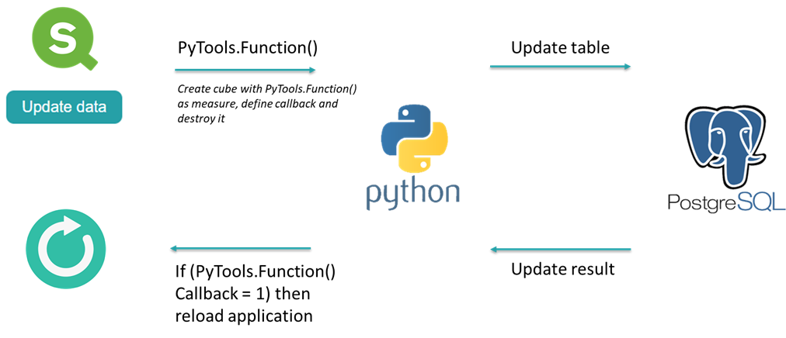
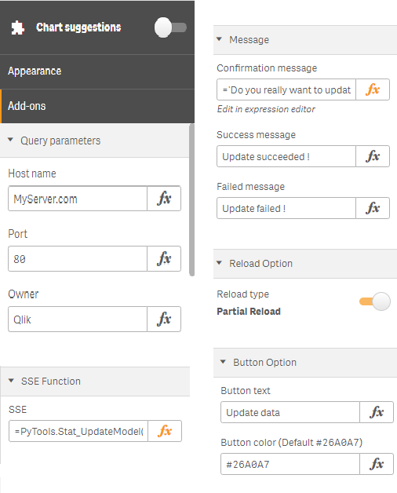

Reload Button for Qlik Sense

1. Send parameters to Python SSE extension
2. Python update a database
3. Reload (full or partial) the Qlik Sense application

## Process

## Extension properties

1. Query Parameters 

2. SSE Function
   - Function SSE

3. Message
   - Confirmation message
   - Success message
   - Failed message

4. Reload Option
   - Partial or full reload

5. Reload Button
   - Button text
   - Button color

## Demo

## Install
1. Qlik Sense Desktop
Unzip the downloaded zip file into "C:\Users\%USERNAME%\Documents\Qlik\Sense\Extensions\Qlik-Sense-Reload-Button" folder.

2. Qlik Sense Server
Please refer to the following instruction for importing an extension:

	[Import Extension]( http://help.qlik.com/sense/en-US/online/#../Subsystems/ManagementConsole/Content/QMC_Resources_Extensions_AddingExtensions.htm?Highlight=add extension "Import Extension")

Following procedure is experimental:
When you reload a **published** app (not an app in "My work"), the following error occurs. This is because the default security rules of Qlik Sense Server does not allow users to update published apps.

You can allow published apps to be reloaded and saved by adding a security rule on QMC. For example, following security rule allows any users to execute reload button on published apps in "Everyone" stream.

|Name|Setting|
|---|---|
|Resource filter|App*|
|Conditions|(((resource.resourcetype="App" and resource.stream.name="Everyone")  or (resource.resourcetype="App.Object" and resource.app.stream.name="Everyone")))|
|Context|Both in hub and QMC|
|Actions|Update|

**Please be are that it can cause unexpected results, so apply the setting at your own risk!**

## Licence
The software is provided "AS IS" without warranty of any kind. This project is licensed under the terms of the MIT license.

## Author
Paul Calvet / forked from mhamano/Qlik-Sense-Reload-Button